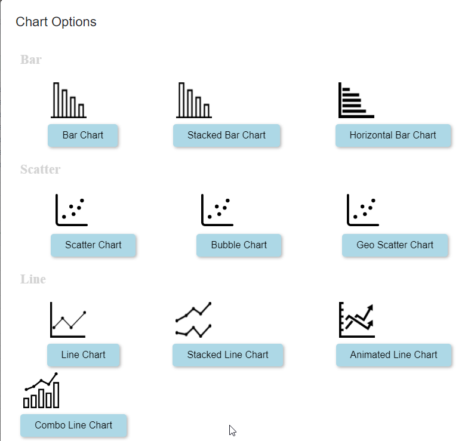
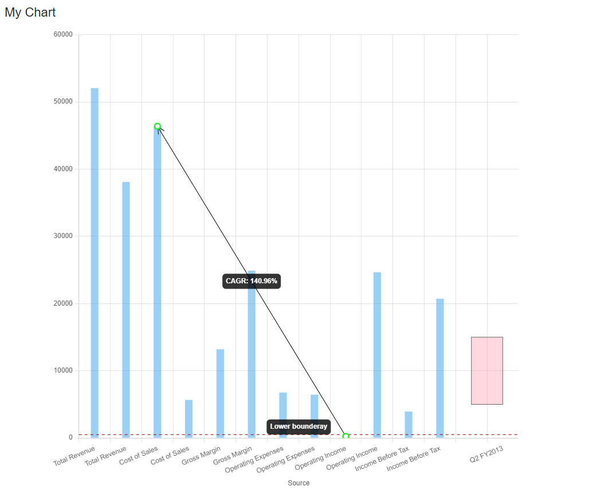
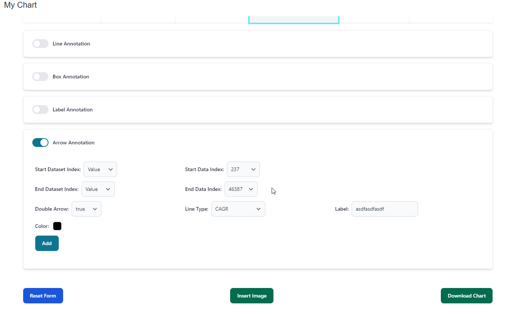

# Google Sheet Script Project

This is a Google Apps Script project for working with Google Sheets.

## Project Description

This project provides a set of functions and utilities to generate the effective charts with various kinds of annotations and configurations.

## Getting Started

### Development mode
`npm run dev` 

### Production mode
`npm run build` 

It will update the following packages.
https://raw.githack.com/aimardev/colby-react/dev/dist/assets/index.js
https://raw.githack.com/aimardev/colby-react/dev/dist/assets/index.css
https://raw.githack.com/aimardev/colby-react/dev/dist/assets/custom.js

## Usage

To use the functions in this project, follow these instructions:

1. Open the Google Sheets document where you want to use the functions.
2. Select "Custom Menu" > "Chart Me" to open the custom menu.
3. Choose an option from the Chart Me to perform the desired operation.

